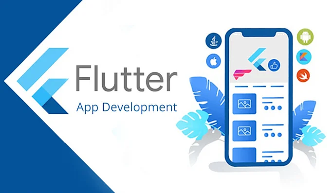
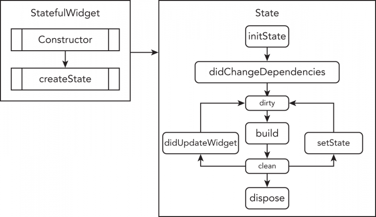
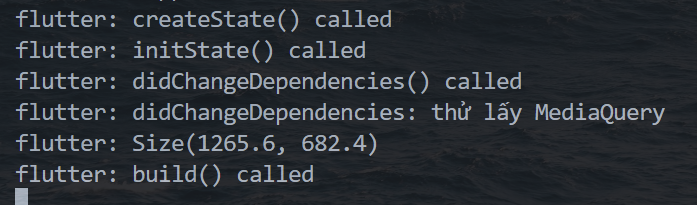
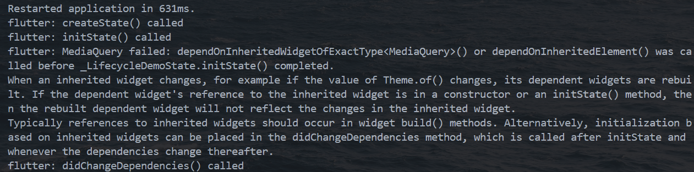
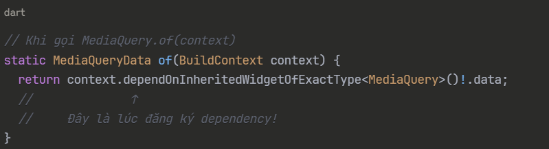
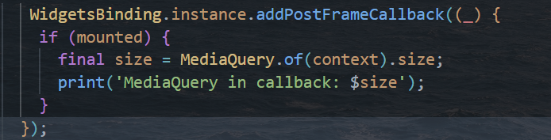
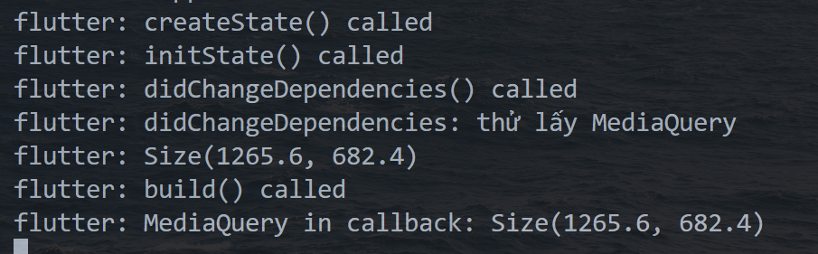

# **Widget Lifecycle in Flutter**
<p align="center">
  
</p>

### Overview
<p align="center">
  
</p>
Widgets in Flutter are mainly of two types:

1. **StatelessWidget** – immutable, no lifecycle beyond build.
2. **StatefulWidget** – has a **lifecycle** because it maintains **state**.

Let’s focus on **StatefulWidget**, since that’s where the full lifecycle exists.

---

### 1. `createState()`

* **Purpose**: Called **once** when the framework creates the widget.
* **Technical term**: Creates a `State` object (the mutable part of the widget).
* **Analogy**: It’s like allocating memory and initializing an instance.

---

### 2. `initState()`

* **Purpose**: Called **once** when the `State` object is inserted into the widget tree.
* **Use case**: Initialize variables, subscribe to streams, fetch initial data.
* **Technical term**: It’s the **initialization phase**.
* **Important**: Must call `super.initState()`.

---

### 3. `didChangeDependencies()`

* **Purpose**: Called when a widget’s **inherited widgets** (like `Theme` or `MediaQuery`) change.
* **Technical term**: Dependency resolution hook.
* **Use case**: When you need to react to external data that the widget depends on.

---

### 4. `build()`

* **Purpose**: Describes the UI by returning a **widget tree**.
* **Technical term**: Rendering phase.
* **Frequency**: Called multiple times (every time `setState()` is triggered).
* **Important**: Must be **pure** (no side effects).

---

### 5. `didUpdateWidget(oldWidget)`

* **Purpose**: Called whenever the parent widget rebuilds and passes new configuration.
* **Technical term**: Configuration update hook.
* **Use case**: Compare `oldWidget` with `widget` to react to prop changes.

---

### 6. `setState()`

* **Purpose**: Marks the widget’s state as dirty → triggers a rebuild.
* **Technical term**: State mutation + re-render trigger.
* **Important**: Only call inside the widget’s `State` class.

---

### 7. `deactivate()`

* **Purpose**: Called when the widget is removed from the tree **temporarily**.
* **Technical term**: Lifecycle interruption hook.
* **Use case**: Rarely used, but useful when widgets are moved in the tree.

---

### 8. `dispose()`

* **Purpose**: Called when the widget is **permanently removed** from the tree.
* **Technical term**: Cleanup phase.
* **Use case**: Close streams, cancel timers, free resources.
* **Important**: Must call `super.dispose()`.

---

## Visual Flow (Lifecycle Order)

```
createState()  
   ↓  
initState()  
   ↓  
didChangeDependencies()  
   ↓  
build()  
   ↓   (possible loop if setState is called)
didUpdateWidget()  
   ↓  
deactivate()  
   ↓  
dispose()
```

---

## Technical Summary

* **Initialization phase**: `createState()`, `initState()`
* **Dependency phase**: `didChangeDependencies()`
* **Build phase**: `build()`
* **Update phase**: `didUpdateWidget()` + `setState()`
* **Removal phase**: `deactivate()` → `dispose()`


Minh họa: 



**Một số vấn đề cần chú ý:** 
- Không thể sử dụng BuildContext để truy cập các thuộc tính từ InheritedWidget trong phương thức initState().

```Trong initState(), context chưa được "gắn" với widget tree đầy đủ, nên việc gọi context.dependOnInheritedWidgetOfExactType() sẽ gây lỗi hoặc trả về null. Nếu cần truy cập InheritedWidget, nên làm điều đó trong didChangeDependencies().```



``MediaQuery failed: dependOnInheritedWidgetOfExactType<MediaQuery>() or dependOnInheritedElement() was called before _LifecycleDemoState.initState() completed.
When an inherited widget changes, for example if the value of Theme.of() changes, its dependent widgets are rebuilt. If the dependent widget's reference to the inherited widget is in a constructor or an initState() method, then the rebuilt dependent widget will not reflect the changes in the inherited widget.
Typically references to inherited widgets should occur in widget build() methods. Alternatively, initialization based on inherited widgets can be placed in the didChangeDependencies method, which is called after initState and whenever the dependencies change thereafter.``

**Remind:**

InheritedWidget khi thay đổi => Nó sẽ rebuild lại toàn bộ widget con nào đang phụ thuộc vào nó. 

Vậy làm sao InheritedWidget biết được những thằng nào đang phụ thuộc vào nó. 

--> Nhờ vào việc đăng ký dependency thông qua BuildContext.dependOnInheritedWidgetOfExactType (trực tiếp hoặc gián tiếp khi gọi of(context)).

--> mà sự đăng ký này chỉ được thực hiện sau khi initState completed.




**Solution:**



Thứ tự xuất hiện của nó lúc này thế nào trong widget lifeCycle 


